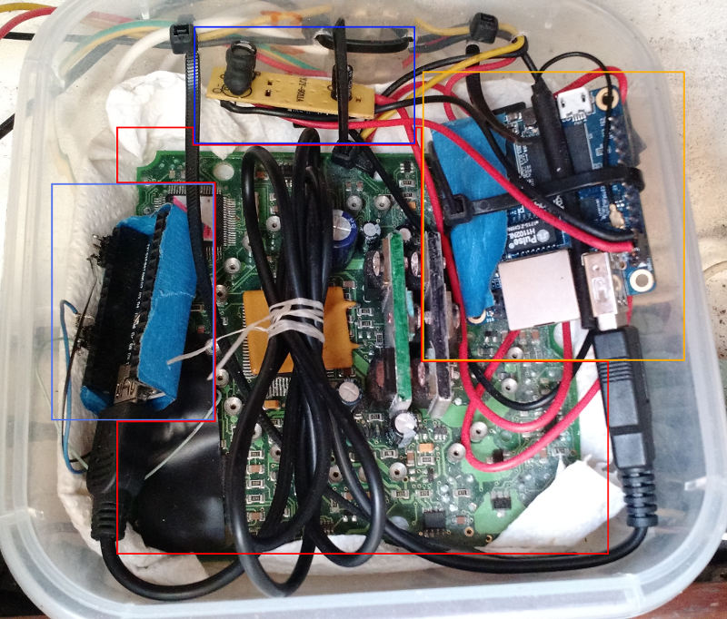

# ysvpanel
It is instrument panel project for boats, sailboats for multiplexers working on nmea and mqtt :)
App or I should write web page is a html,javascript it's working in web brawser as an web page.
It displays incoming instruments value from mqtt. Check https://github.com/yOyOeK1/tcp_toFrom_mqtt 
it is related.

It is now in early stage.

Hardware: 
My setup from scraps :)
old autohelp 5000+ as a voltage level buffer uart 5v on arduino seatalk ~13v
arduino nano connected to IC on autohelm 5000+ to get data in UART console
  9bit read/write to seatalk bus
orangepizero main brain of operation running armbian on it mqtt broaker, kplex, 
  tcp_toFrom_mqtt, http server
power supply usb car charger
aditional capacitors :P

ToDo:
- themes day and night
- fonts for instruments adaptive size for screen size (big !, easy readable)
- clean up code
